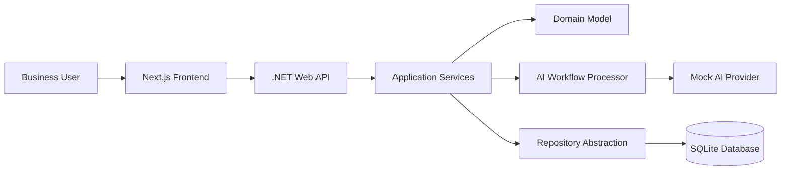

# AI Workflow Automation Dashboard

A full-stack portfolio project that demonstrates how repetitive business workflows can be converted into structured, traceable and AI-assisted internal tools.

This project is designed to show practical full-stack engineering, AI workflow design, clean architecture and product thinking for internal business tools. It is not just a CRUD demo: the core experience follows a business request from structured input, to mock AI-assisted output, to human review, approval and history.

## Business Problem

Many small businesses and internal teams still manage repetitive workflows through Excel, email, WhatsApp, documents or unstructured notes. This often creates duplicated work, inconsistent outputs, lack of traceability and slower response times.

This project demonstrates how those workflows can be structured, processed with AI assistance and reviewed by a human before being finalized.

## Solution

AI Workflow Automation Dashboard lets users create structured workflow requests, generate AI-assisted drafts, review and edit the generated result, save a human-reviewed output and keep the full request available in history.

The application follows a human-in-the-loop approach:

- AI helps generate a useful first draft.
- The user remains responsible for review and approval.
- Original input, generated output and reviewed output stay separated.
- Request status gives visibility into the business process.

## Core Workflow

1. Create a structured workflow request.
2. Add business context, notes and desired output type.
3. Generate a mock AI-assisted output.
4. Review and edit the generated result.
5. Save the reviewed output.
6. Track the request status.
7. Keep the request available in history.

## Features

- Dashboard summary for workflow visibility
- New workflow request form
- Request history
- Guided request detail workflow
- Mock AI-assisted output generation
- Human-reviewed output step
- Status tracking
- Priority labels
- Copy generated or reviewed output
- Floating toast notifications for action feedback
- Loading, empty and error states
- Professional internal-tool UI
- Development demo data for portfolio walkthroughs

## Example Use Cases

- Generate professional emails from unstructured notes
- Create internal reports from business context
- Summarize client requests
- Produce action plans
- Standardize repetitive documentation
- Support administrative workflows
- Convert manual processes into structured digital workflows

## Tech Stack

### Frontend

- Next.js
- React
- TypeScript

### Backend

- .NET 8 Web API
- C#
- Layered API, Application, Domain and Infrastructure structure

### Database

- SQLite for local demo persistence
- Entity Framework Core migrations
- Optional future persistence: PostgreSQL

### AI

- AI workflow processor abstraction
- Mock AI provider for local demo
- Future-ready real provider integration through environment variables
- No hardcoded API keys

## Architecture Overview

The project uses a simple full-stack architecture that keeps UI, API orchestration, domain concepts, persistence and AI provider implementation separated.



Frontend responsibilities:

- Render dashboard, request form, history and guided request detail views
- Call the backend through a typed API service
- Keep UI states clear: loading, empty, error and action feedback
- Keep API configuration in environment variables

Backend responsibilities:

- Expose REST API endpoints
- Manage workflow request lifecycle
- Keep controllers thin
- Run business use cases in application services
- Keep domain entities and enums in the domain layer
- Isolate AI generation behind an abstraction

## Project Structure

```text
frontend/
  app/
  components/
    layout/
    ui/
  features/
    dashboard/
    history/
    requests/
  lib/
  services/
  types/

backend/
  src/
    Api/
    Application/
    Domain/
    Infrastructure/
      Persistence/
        Migrations/
  tests/

docs/
  architecture.md
  decisions.md
  project-brief.md
  screenshots/
```

## Screenshots

Screenshots should be captured for GitHub, LinkedIn Featured and portfolio use after the UI is finalized.

Planned screenshot checklist:

- Dashboard
- New Request form
- Request History
- Request Detail: captured request step
- Request Detail: AI-generated output step
- Request Detail: human review step
- Request Detail: archived confirmation

Screenshot planning notes are available in [docs/screenshots/README.md](docs/screenshots/README.md).

## Local Setup

### Prerequisites

- Node.js
- npm
- .NET SDK with `net8.0` targeting support

### Frontend

```bash
cd frontend
npm install
npm run dev
```

The frontend runs at:

```text
http://localhost:3000
```

Build the frontend:

```bash
cd frontend
npm run build
```

### Backend

```bash
cd backend
dotnet run --project src/Api/Api.csproj
```

The backend API runs at:

```text
http://localhost:5080
```

Swagger is available in local development:

```text
http://localhost:5080/swagger
```

Build the backend:

```bash
cd backend
dotnet build
```

The local SQLite database is created automatically when the backend starts. EF Core applies migrations at startup and stores local data in:

```text
backend/src/Api/workflow-automation.db
```

The database file is ignored by Git.

## Testing

Run the backend test suite:

```bash
cd backend
dotnet test
```

Current backend tests cover:

- Workflow request creation with Draft status and UTC timestamps
- Mock AI generation status changes and generated output storage
- Human review output validation and Reviewed status updates
- Archive flow and request retrieval after archiving
- Not-found behavior for workflow actions
- Mock AI output variations for each desired output type

Intentionally not covered yet:

- Browser-based end-to-end tests
- Full API integration tests
- Real AI provider behavior
- EF Core internals

## Environment Variables

Create a local frontend environment file from the example:

```bash
cd frontend
cp .env.example .env.local
```

Required frontend variable:

```text
NEXT_PUBLIC_API_BASE_URL=http://localhost:5080
```

Do not commit `.env.local` or secrets.

## API Endpoints

Current backend MVP endpoints:

- `GET /api/workflow-requests`
- `GET /api/workflow-requests/{id}`
- `POST /api/workflow-requests`
- `POST /api/workflow-requests/{id}/generate`
- `PUT /api/workflow-requests/{id}/review`
- `PUT /api/workflow-requests/{id}/archive`

## Local Persistence And Demo Data

In Development, the SQLite database is seeded with realistic fake workflow requests only when the database is empty. This keeps the dashboard, history and detail screens useful immediately during demos while preserving requests created during local testing.

Demo examples:

- Client onboarding summary
- Internal weekly report
- Professional email response
- Process improvement action plan

Demo data is fake. Local workflow requests persist across backend restarts until the local SQLite database file is deleted.

## Manual Demo Flow

1. Start the backend.
2. Start the frontend.
3. Open Dashboard.
4. Review the workflow summary cards and recent requests.
5. Create a new workflow request.
6. Open the request detail page.
7. Follow the guided workflow from captured request to AI-generated output.
8. Start human review and edit the reviewed output.
9. Save the reviewed output.
10. Copy the reviewed output.
11. Continue to archive and archive the request.
12. Confirm the request appears correctly in History.

## What This Project Demonstrates

- Full-stack engineering with React, Next.js and .NET
- Business process automation thinking
- AI-assisted workflow design
- Human-in-the-loop review patterns
- Clean REST API boundaries
- Typed frontend API integration
- Layered backend architecture
- Mock-provider-first AI integration
- Professional internal-tool UX
- Loading, empty, error and toast feedback states
- Portfolio-ready documentation and demo flow

## Current Status

In development.

Implemented:

- Frontend pages for dashboard, new request, history and request detail
- Backend workflow request API
- Mock AI output generation
- SQLite persistence with EF Core migrations
- Guided request detail workflow
- Human-reviewed output flow
- Archive flow
- Floating toast notifications
- Development demo data

## Future Improvements

These are intentionally outside the current MVP scope:

- Add real AI provider integration behind the existing abstraction
- Add prompt versioning documentation
- Add frontend behavior tests when the UI stabilizes further
- Capture final screenshots for GitHub, LinkedIn and portfolio pages
- Add deployment documentation when deployment is in scope
