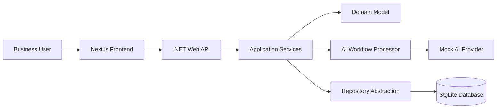

# Architecture

## Overview

The project uses a simple full-stack architecture with a Next.js frontend and a .NET 8 Web API backend.

The architecture remains simple, maintainable and easy to understand for portfolio review.

## High-Level Structure

- Frontend: Next.js, React and TypeScript
- Backend: .NET 8 Web API
- Persistence: SQLite through EF Core
- AI Layer: Mock provider first, real provider later through abstraction

## High-Level Flow



The main workflow is:

1. The user creates a structured request in the frontend.
2. The frontend sends the request to the backend API.
3. Application services coordinate request lifecycle changes.
4. The AI workflow processor creates a mock generated output.
5. The user reviews and saves a human-reviewed output.
6. The request remains available in history with its status and timestamps.

## Frontend Structure

Current structure:

```text
frontend/
  app/
    page.tsx
    requests/
      new/
      [id]/
    history/
  components/
    layout/
    ui/
  features/
    dashboard/
    requests/
    history/
  services/
  types/
  lib/
```

Frontend responsibilities:

- Render dashboard
- Create workflow requests
- Display request history
- Display request details
- Trigger AI generation
- Allow output review and editing
- Show loading, empty and error states
- Call the backend through a typed API service using `NEXT_PUBLIC_API_BASE_URL`

## Backend Structure

Current structure:

```text
backend/
  AiWorkflowAutomationDashboard.slnx
  src/
    Api/
    Application/
    Domain/
    Infrastructure/
      Persistence/
        Migrations/
  tests/
```

Backend responsibilities:

- Expose REST API endpoints
- Manage workflow request lifecycle
- Persist workflow requests
- Generate AI-assisted outputs through abstraction
- Handle errors consistently
- Keep business logic outside controllers

## Backend Layers

### Api

- Controllers
- API contracts
- Request/response handling

### Application

- Use cases
- Application services
- Validation
- Workflow orchestration

### Domain

- Entities
- Enums
- Core business concepts

### Infrastructure

- AI provider implementations
- EF Core SQLite workflow request repository
- Development-only fake demo workflow requests for portfolio demos when the database is empty
- External integrations later

## AI Layer

The AI integration must be isolated behind an interface.

Expected concept:

```text
IAiWorkflowProcessor
```

Implementations:

- MockAiWorkflowProcessor first
- Real provider implementation later

Rules:

- Do not hardcode API keys
- Use environment variables for real providers
- Store generated output separately from reviewed output
- Handle AI failures gracefully
- Keep original input traceable

## Initial Domain Concepts

Main entity:

```text
WorkflowRequest
```

Expected fields:

- Id
- BusinessName
- Title
- RequestType
- Context
- Notes
- DesiredOutputType
- Priority
- Status
- GeneratedOutput
- ReviewedOutput
- CreatedAt
- UpdatedAt
- ProcessedAt
- ErrorMessage

Enums:

### RequestType

- DocumentGeneration
- BusinessSummary
- ClientResponse
- InternalReport
- ProcessAnalysis

### OutputType

- ProfessionalEmail
- StructuredReport
- ActionPlan
- ExecutiveSummary
- ClientFacingResponse

### RequestStatus

- Draft
- Processing
- Generated
- Reviewed
- Archived
- Failed

### Priority

- Low
- Medium
- High

## Initial API Endpoints

Implemented backend MVP endpoints:

- GET /api/workflow-requests
- GET /api/workflow-requests/{id}
- POST /api/workflow-requests
- POST /api/workflow-requests/{id}/generate
- PUT /api/workflow-requests/{id}/review
- PUT /api/workflow-requests/{id}/archive

## Current Persistence

The backend uses SQLite through Entity Framework Core behind `IWorkflowRequestRepository`.

The local database is created automatically when the backend starts. EF Core applies migrations at startup and stores data in `workflow-automation.db`.

In Development, the database seeds fake workflow requests only when it is empty so the UI can demonstrate dashboard visibility, history and detail review flows immediately without overwriting local test data.

## Swagger

Swagger is enabled in local development so the backend workflow can be tested without frontend integration.

## Frontend And Backend Integration

The frontend calls the backend through `frontend/services/workflowRequestsApi.ts`.

The backend base URL is configured with:

```text
NEXT_PUBLIC_API_BASE_URL
```

For local development, the expected value is:

```text
http://localhost:5080
```

The backend enables a local development CORS policy for:

- http://localhost:3000
- http://127.0.0.1:3000

## Architecture Principles

- Keep controllers thin
- Use DTOs for API contracts
- Keep business rules out of UI components
- Use clear service boundaries
- Avoid overengineering
- Keep the project easy to run locally
- Keep documentation updated
